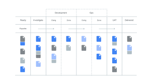

# The DevOps HANDBOOK の読書とメモ

# イントロダクション

筆者は共同でこの本を記載しているが、全員に共通することは DevOps に関してみんなアハ体験をしていること。

「あっわかった」その正体にはっと気づくような体験のことらしい。

またイントロの中で DevOps によくある誤解が述べられている。

- DevOps は単なる自動化・もしくはインフラのコード化だ

↑ の認識は結構ある気がする。

実際のところは DevOps は IT 組織全体で共通の目標を達成するための文化や規範をも必要とする。

オートメーションは DevOps という文化を成すための一つの構成要素や手段に過ぎないのではないか。

## 序章

技術的負債とは「私たちの判断で引きおきされた問題が将来の選択肢を狭めていくこと」

IT がうまくいかないと組織全体がうまくいかず、ダメージがゆっくり現れても、急に現れても破壊は同じように起こる。

「恐怖で支配する文化」ではなく、高信頼マネジメントにより「リスクを追う人が評価される協力を尊ぶ文化を作る。」

問題を解決するためには問題を直視しなければならないのだ。

DevOps の実践をしている会社とそうでない会社では以下のような違いがあった

- コードの変更とデプロイ 30 倍
- コードと変更のデプロイのリードタイム 200 倍
- 本番デプロイ(成功率が 60 倍高い)
- サービス復元の時間(168 倍早い)

## 1 章

DevOps はトヨタ生産方式（リーン生産方式）を IT に応用したもの

- フロー
- フィードバック
- 継続的な学習と実験

継続的デリバリーはコードとインフラストラクチャを常にデプロイ可能な状態に保ちトランクにチェックインされたコードは全て本番環境に安全にデプロイできるようにする
という考え方

日々習慣的に業務の改善を行うという改善のカタを作り上げることが重要

IT バリューストリームとは

- ビジネス上の仮説を立案してから顧客に価値を送り届ける技術サービスを生み出すまでの間に必要なプロセス

↑ を図るための指標が２つ

- リードタイム
  - 顧客が要求をした時から要求が満たされるまでの間の時間
- プロセスタイム
  - 顧客の要求のための作業を開始した時から満たされるまでの間の時間

DevOps では開発者は自分の仕事に対するフィードバックをコンスタントに受け取り、他部門からの制約を受けずに素早くコードを実装、〜本番環境へのデプロイができる。

### DevOps の 3 つの道

- 開発 → 運用 → 顧客の左から右へのワークフローを高速にする
  - 仕事を可視化し、バッチサイズと作業のインターブルを削減し、品質を組み込み、下流のワークセンターに不良品を渡さない
  - 絶えず改善を続けていく
- バリューストームのあらゆるステージで素早くてコンスタントな右から左へのフィードバックフローを受け取ること
- 成功と失敗の両方から組織として学習し教訓をえていく生産的な高信頼マネジメントの企業文化を生み出すこと
  - チーム内の発見を組織全体の経験の蓄積とする

### 2 章

開発　 → 　運用　への作業を素早く、かつミスなく届けるにはカンバンによる管理が良い。

この時カンバンはできるだけバリューストリーム全体を対象としていて、作業完了が右端に達した時に限るようにすればよい。

- マルチタスクで仕事をしている時には単純なタスクでも作業効率が大きく下がる
- 看板で各段階において、WIP(仕掛かり)として良いカードの数を制限する
- バッチサイズを小さく（問題ごとを小さくして、確実に解消していく）
  - 作業を小分けにすることで作業ミスによる手戻りもすくなくなり、生産性が上がる
- 日常業務からムダを削減する
  - 組織の目標達成のために継続的に学習することによって日常業務から苦痛と重労働を取り除くこと
  - 結果に影響を及ぼさずに省略できる皇帝など
    - 部分的に完成した仕事（途中のドキュメントとか）
    - 余分な処理
    - 余分な機能
    - など

作業を可視化し、WIP を減らし、バッチサイズを縮小して作業の受け渡しの負荷を減らして、制約条件を継続的に見つけ出して評価し、日常業務から苦痛を取り除く

### 3 章

- IT に限らず複雑なシステムにおいてエラーは必然であり不可避なので、あらゆる障害を発見できるという自身の元、恐怖を感じずに仕事ができる安全なシステムを設計しなければならない
- パフォーマンスが高い工場であらゆるバリューストリームの中に作業が測定、モニタリングされていて、不良や大きな逸脱があればすぐに誰かが見つけて対処する
- 問題が発生した時に一丸となって解決し、下流に影響を与えない。この一丸というのが、プロセス全体を止めるようであるが、学習が可能になる。
  - 記憶が薄れたり、状況が変化したりすることによって極めて重要な情報が失われることを防ぐ
- 本番環境のインシデントであれ、バリューストリームの早い段階のエラーであれ、なんか問題を起こした時に非難されずに、むしろそうすることが推奨される文化を作ることが重要
- バリューストリームないの全ての人々が、日常業務の一部として自分の担当分野の問題を見つけて修正していく日つゆがある。
- 開発・運用の特定の部門に責任が追及されないように、QA や情報セキュリティチームの品質チェックを自動化する
  - また、開発者がテストをリクエストするのではなく、開発者がオンデマンドでテストを実行できるようにする

素早くフィードバックを返して学習する。
問題の発生時には組織が一丸となって問題解決にあたり、新しい知識・知恵を生み出して上流で品質を確保する。

### 4 章

第３の道は継続的な学習の文化を作り出すことに着目する。

個人がコンスタントに知識を生み出して、それをチームや組織の知識に転化していくための原則。

- 事故や問題が起きた時に対応を誤ると、人々の心に注意深さではなく恐怖を植え付け、注意深い組織ではなく官僚主義的な組織を作り上げてしまう
- インシデントが起きた時は必ず「非難なしのポストモーテム（事後検証）を実施すると良い」
  - 非難を取り除けば恐怖が取り除かれ、恐怖が取り除かれれば正直になれる。正直になれば予防ができるようになる

#### 日常業務の改善を制度化する

- 問題の根本的な解決を避け、日常的な予防策に頼っていると、問題と技術的負債が蓄積し、やることなすこと全てがその予防策にすがり大きな障害から逃げ回ることになる
  - 日常業務より大切なのは日常業務の改善だ
  - 逆に技術的負債の解消のために正式に時間をとって、リファクタ改善をすれば日常業務を改善できる

### 5 章

実際に組織で DevOps 改革を起こすためにはどこから手をつけていけば良いのか。
この章から解説が始まる

DevOps の導入初期の段階では、比較的保守的なグループを巻き込もうとしない。
それよりもリスクを比較的怖がらないグループで成功を収めて、そこを基盤にしてしまう。
（これをイノベーターとアーリーアダプターを見つけると表現する）

- 最初の段階では問題解決を早くしたいと考えている人たちとグループを作る
- 次の段階でより多くのチームに DevOps を普及させていく。↑ で作ったチームを派遣したりとか（マキシンがやったことやん）
- 抵抗派を明らかにする。ここと対峙するのは ↑ で基盤をつくって、大勢を味方につけてから

### 6 章

バリューストリームないの作業を理解し、それを可視化して組織全体に広げる

- DevOps への変革の候補となるアプリ・サービスを選択したら顧客に対して価値を生み出すために協力しなければならないバリューストリームのなかの全てのメンバーを明らかにする必要がある
  - 製品オーナー
  - 開発
  - 品質保証（QA）
  - 運用
  - 情報セキュリティ
  - リリースマネージャー
  - IT 担当役員・バリューストリームマネージャー
- 次にバリューストリームに具体的にどのような作業があるか把握する（イメージは以下)
  - 要望ヒアリング
  - 設計と分析(1 週間, 完全正確率: 60%)
    - 例えば 60%の要望しか正しくヒアリングできていないなど。
    - 前段で正しくバリデーションできていればもっと正確率をあげて効率化することができるのか。などみていく
- 専任の変革チームを編成する
  - 測定可能なシステムレベルの成果を生み出すことに専念させる
    - git システムにコードをプッシュしてから本番環境にデプロイをするまでのリードタイムを 50%にするみたいな
  - DevOps の仕事だけを与える
  - チームメンバーにはあらゆる分野のジェネラリストを選ぶ
- 改善の計画期間を儲ける時は小さく、一個の期間を短くする
  - 数週間から最悪での数ヶ月
- ポジティブでユーザーからは見えない価値を生み出す作業に 20%のサイクルを投資する
  - アーキテクチャー・非機能要件・プロセスの改善・リファクタ・メンテナンス性・セキュリティ
  - 組織が 20%ルールを守らないと、技術的負債がいっぱいになり、それらの解消に全てを当てる必要が出てくる

### 7 章

バリューストリームの目標を達成するために、どのような専任の組織を作る必要があるか。

- Conway の法則
  - システムを設計する組織は組織内のコミュニケーション構造のコピーになっているような設計しか出せない。
  - 組織が大きいほど柔軟性が低くなり、この現象は明白になる
  - どのような構造の組織を作るかで、作られるソフトウェアやアーキテクチャに強い影響を与える
  - 組織間で互いに依存する仕事があると、コードも密結合になってしまい、安全な変更ができなくなる。
- 組織の構造
  - 職能型組織
    - IT の伝統。データベースグループ、ネットワークグループ、開発グループみたいに求められる職務上の能力に応じて組織を分ける。情シス時代もこうだった。
    - 互いに他のチームに依存するようになるためリードタイムは長くなる。
    - 人員は自分の仕事がバリューストリームのどこになるかわかりにくい。
      - 言われたからやっているだけ。モチベーションもクソもない。
    - 職能組織だと無理というわけではなく、共通の目標として顧客と全体としての組織が生み出す結果を意識できていれば DevOps の成果を実現可能
    - パフォーマンスの高い組織では、社員が共通の目標を目指している。
  - DevOps の成果を得たいなら、職能思考の影響を抑え、市場指向（スピードのために最適化）を実現して独力で安全に仕事を進められる小さなチームを編成して、顧客に価値を早く届けられるようにする必要がある。
  - Facebook の例
    - Facebook はむかしコードのデプロイに大きな問題を抱えていて、長時間労働も状態かしていた
    - そんなかで有効だったのが「自分が作らせた機能・システムの電話サポートをエンジニア・技術系管理職にさせること」だった
      - The Unicorn Project でもマキシンがやっていた
    - 全てのチームメンバーがジェネラリストになれるようにする
      - 高度に専門化された部署だとそれぞれが主権国家のように、要求や権利を主張する
        - わかる。これ。公務員時代がそうで、みんな自分の部署の仕事をすることしか頭になくて、他の仕事なんてわからなかった（組織としてなんでその仕事が必要かということもわかっていなかったような気がする)
      - アプリケーションデプロイに必要な全ての皇帝の理解がある「フルスタックジェネラリストエンジニア」という言葉も使われるようになった
      - 専門家よりもジェネラリストの方がバリューストリーム全体でみた時に、キューを消費するのが圧倒的に早いとのこと
    - ジェネラリストにならせるには組織として社員に学習できる機会を提供する必要がある。
      - チーム間のコミュニケーションに問題があるなら、仕事として「他のチームに LT を発表させる」時間を提供させたりすれば良い
      - 会社として顧客ともそのような時間を取ることを合意しておき、「仕事」として学習の機会を提供すれば良い
  - Amazon の場合
    - チームを小さく保つ。ピザ２枚で満足できるように、5 人から 10 人程度にする。
      - 自分たちが取り組んでいるシステムの明確な理解を共有できる
      - 開発しているものの成長スピードが抑えられる。チームがしすてむについて共通理解を維持するのに役立つ
      - 権力を分散し、チームが独立して動ける。
      - 社員が多くリーダー経験を積むことができる。（しかも失敗の影響を局所化できる）

### 8 章

- セルフサービスで運用プラットフォームを手に入れられなければ、クラウドは高くつくホスティングの 2.0 に過ぎない
- 製品チームに運用エンジニアを配置する
  - 運用エンジニアは社内外の顧客とみせっつに関われる
  - 人が作ったものをただ使うのではなく、自分で良いものを生み出すことに協力しようとする
  - 開発と組ませることで運用の知識と能力を開発チームに伝えることもできる
  - 運用の知識を自動化コードにすることもしやすい
- 全てのチームに運用を配置することができなければ
  - 個々のチームに連絡担当をつける
  - 指名運用エンジニア
    - この人たちには以下のようなことが求められる
    - 新しい製品の機能。なぜそれを作るのか
    - 運用可能性・スケーラビリティ・可観測性に関しての製品はどうなっているのか

開発の日常に運用を統合する。

### 9 章

ここから第３部

本番環境や顧客のもとで混乱や停滞を引き起こしたりせずに、開発から運用への仕事のフローを早くして、
それを維持するために必要な技術的実践やアーキテクチャを作り出すことを目標とする。
そのために本番環境に変更をデプロイし、リリースする時のリスクを減らす必要がある。
（ここから継続的デリバリーの話になっていくみたい）

- 書類やウィキで本番環境の使用を文書化するだけでなく、開発・テスト・本番などのさまざまな環境を全て作成できる共通ビルドメカニズムを作る必要がある
  - 既知の良い環境を定義・作成を自動化する必要がある
- 修理するよりも再構築する方が簡単なインフラを作る
  - 本番環境作成に手作業を許さない。git にマージされた時点で 0 からコードと環境を作り直す以外の方法を許さない
- 本番に近い環境で動作することの確認も含めて「完成」というように定義を変える
  - これめっちゃある。チケット管理でもこの辺が曖昧でひどい人だと「ステージング環境へのデプロイ待ちだからということで「デプロイ待ち」にする人もいる。

### 10 章

高速で信頼性の高い自動テスの実現について

- 開発における継続的インテグレーションとは複数のコードブランチをトランク（master とか）にインテグレートしてユニットテストに合格させることだと考えられている
- が、本番に近い環境での実行と受け入れ、インテグレーションテストでの合格を義務つけることを CI+と呼ばれる。この本では CI ＋のことを CI と表現している
- ユニットテストでは DB などの外部の依存システム、コードなどをスタブアウトすることが多い（モックを使って静的な値を返す）
- 受け入れテストではアプリケーション全体をテストして、高水準の機能が期待通りに動いていることを証明する
- デプロイパイプラインではユニットテストが合格すると、受け入れテストにかける。受け入れテストに合格した後はインテグレーションテストとマニュアルテストに回される
- インテグレーションテストではスタブアウトされたインターフェースを呼び出したりせず、本番稼働されている他のアプリケーションやサービスと正しくやりとりできているか確認する
- 極力ユニットテスト・受け入れテストで欠陥を詰んでおくのが良い
- 開発者はユニットテストを書くのをサボってしまうので 80%のカバレッジを満たさない場合は不合格としてもよいくらい。
- 自動テストは高速に実行されるようにできれば並列で実行する
- コードを書く前にテスト駆動開発を行う
- できるだけマニュアルのテストを減らす
  - テストは自動化でできるが価値を生み出すことは人にしかできない。
    　- 自動化すべきテストを人間にさせるのは本末転倒
- テストスイートにパフォーマンステストを統合する
- テストが失敗した場合はそれ以上のコードのコミットを禁止させ、チーム全体で解決にあたる

### 11 章

継続的インテグレーションの実現と実践について

- デプロイパイプラインがエラーを起こすような変更がなされた場合、チームが問題に向きあいデプロイパイプラインをグリーンな状態に戻す
- コードベースを積極的にリファクタしなければ時間とともにコードベースは落ちていき、新機能を追加するペースが落ちていく
- トランクベースの開発
  - 全てのデベロッパーが１日に少なくとも１回はトランクにコードをチェックインする
  - デプロイ可能な状態を壊すようなコミット(force push とか)は拒否するように設定する

### 12 章

- カナリアリリースとは
  - 少数の本番サーバーのグループにデプロイして、本物のユーザートラフィックを与えてもひどいことが起きないことを確認する
- 非本番環境をできるだけ本番環境と同等にする
  - セキュリティ的な要件もそう。そこまで一緒にしておかないと、本番に正しくリリースできるかわからない
    開発と運用に共通の目標があり、デプロイの結果に透明性・実行責任、説明責任があるなら誰がデプロイしても構わない
- 自動テストは 4,500 以上あっても１分いないに全てが終わる
  - データベース呼び出しなどはスタブ化しておく
  - スタブは受信メッセージのテストに使う。
    - スタブはテストで注目しているオブジェクトが依存するものを決まりきった動きしかしない偽物に置き換え、テストの合否が注目しているオブジェクトの実装の正しさだけに依存するようにすること
    - オブジェクトがメッセージを受け取った時に適切な返事をするか
  - モックは送信メッセージのテストに使う
    - オブジェクトが副作用のあるメッセージを送信する時、適切な引数・回数で送信しているか
- リリースからデプロイを切り離す
  - デプロイとリリースは同じ意味で使われるが全く異なる目的で使われる
  - デプロイとは指定された環境に指定されたバージョンのソフトウェアをインストールすること
  - リリースは全ての顧客または一部の顧客に対して機能を利用できるようにすること
  - コードと環境は昨日のリリースがアプリケーションのコードの変更を必要としないように作る必要がある
  - デプロイとリリースの２つを混同すると結果を成功に導くくための責任が曖昧となる
  - 開発と運用にはデプロイを成功させる責任を負わせて、製品オーナーにはリリースをビジネスとして成功させる責任を負わせる
- デプロイ・リリースのパターン
  - グリーン・ブルーデプロイ
    - ２つの環境を用意。新規環境にトラフィックを向けて、完全なリリースの準備ができたと判断できなかったら元の環境（グリーン）な環境に戻す
  - カナリアリリース
    - コードが設計通りに動作していることが確かめられるたびにより大きくて重要な環境に順次プロモートしていくという手法
  - アプリケーションレベルでの安全なリリース
    - 機能トグル・・・新機能を利用するか設定で選ばせる

### 13 章

DevOps を実践する企業は既存のライフサイクルを必要に迫られて変更してきた経験がある。

特にモノシリックなサービスからマイクロサービスへの以降などは、ローリスクなデプロイには必要不可欠となってくる。
サービスの初期段階ではモノシリックなフレームワークが有効なことも多いが、後期になってくると変更が難しくなってきて、独立して DevOps を成していくのが難しくなっていく・・・

締め殺しアプリケーションパターンというアプリケーションのパターンとは？

- 現在のアプリケーションが密結合にすぎると判断したら、まず機能の一部を安全に切り離すところから始める
  - これで切り離した部分を安全んいテスト・デプロイできるようになる
- このパターンを使う時には既存の機能を API の背後に置き、その機能には手をつけずにのぞみのアーキテクチャを使って新しい機能を実装し、必要に応じて古いシステムに呼び出しをかける
- バージョン管理された API を介してすべてのサービスにアクセスできるようにする
  - これで新しい部分をリリースする時も古いバージョンが動いているので安心してリリースできる（最悪元の古い方を見るように変更すれば良い）

### 14 章

ここから第４部

第３部では開発から運用への早いフローを生み出すための実践方法などについて記載

ここでは運用から開発への継続的でスピーディーなフィードバックという第２の道を作り出すための必要な技術的実践について

- 全ての問題を発生と同時に知るにはシステムが全体としてどのように振る舞っているかを十分理解できるだけの遠隔測定データを生成するようにアプリケーション環境を設計しなければならない。

- ログレベル

  - DEBUG
    - プログラムで発生しているあらゆることについてのデータ
    - デバッグ中に使われて、本番システムでは無効になっていて、問題が起きた時に一時的に有効になる
  - INFO
    - ユーザーが主体となって行う動作や、システムに固有な動作についての情報
  - WARN
    - 障害発生につながるかもしれない情報
    - アラートを生成したり、、トラブルシューティングを始めるきっかけになる
  - ERROR
    - 障害を知らせることに力点を置いている。API コールエラーや内部エラー条件
  - FATAL
    - 異常終了が必要な状況を知らせる
  - メッセージを ERROR にするかどうかで迷ったら午前４時に起こされたらどうかということを想像する。

- 障害をめぐって非難の応酬になるような文化のもとでは犯人として非難されることを防ぐため、変更をドキュメントにしたり、遠隔測定データを開示するのを避けるようになる
  - 組織としての学習ができないようになってしまう
- データをもとにすることで実際の原因はどこか、何が根本の原因なのかを特定することができる
- 事実に基づく問題解決には MTTR が短縮されるでけでなく、開発と運用はウィンウィン関係にあるという認識を強められるようになる
- 自動テストの状態・デプロイパイプラインのステータス・マシンの状態など欲しいと思った情報をすぐに取得できるようにしておくこと
  - 内部のエンジニアはもちろん、外部の顧客にさえ公開できるようにする
  - これを誰でもすぐ見れる場所に置いておくこと

### 15 章

NetFlix では遠隔測定データを分析して、顧客に影響が出る前に問題点を見つけて解決する事例がある。

- クラスタのノードから「現在の正常値」を計算してそのパターンに適合していないノードを見つけてノードにフラグをつける
- 一番単純な手法が平均と標準偏差
- 問題が起こってからのアラートではなく、その兆候をキャッチしてアラートを出す
  - nginx の場合
    - Web ページのロード時間の増加
    - サーバーのフリーメモリー・ディスクスペースの減少
    - トランザクション処理にかかる時間が正常時よりも長くなるなど
    - ロードバランサーの無効側で動作しているサーバー数の減少など
- 実運用では正規分布にのっとらないケースが多くある
  - 単純に平均をとると平均から飛び抜けた時間帯にずっとアラームがなりっぱなしとなる
- カイ二条分布に似た分布となる

### 16 章

フィードバックグループを実現して開発と運用が安全にコードをデプロイできるようにする

- テスト・デプロイのためにチームを分けるとうまくいかない
- 一つの部門にまとめ、共通の責任と目標を与える必要がある
- 開発者が自分のコードのデプロイを恐る

  - デプロイプロセスを自動化しても、そのデプロイプロセスを稼働させるのをしようとしない。
  - 顧客に言われて本番の誤りに気づくことが多かった
  - そこで遠隔測定を増やしてすぐ過ちに気づけるようにした
  - すると開発者たちも素早くフィードバックを受けれるようになり、デプロイの数も増えて行った

- 開発者に下流の仕事を観察させる
- UX の設計でよく利用されるコンテキスト調査というものがある
  - 顧客が自然な環境でアプリケーションを使うところを観察させる
  - 思わぬところで手を焼いたりしているところを確認できる
- Google の SRE
  - SRE とは何か？
  - 「ソフトウェアエンジニアが以前運用と呼ばれていた仕事をすることになったら SRE になります」
  - SRE は Google のさまざまなチームに配置されるが、希少な存在なので重要な一部のプロダクトにしか配置されない
  - 配置されるためには重要で・運用の負担が低くならない限りはデベロッパーの管理のままになる
  - LRR・・・新しいサービスが一般公開され本番トラフィックを受け付ける前にされる調査。製品チームの自己申告
  - HRR・・・サービスが運用管理状態に移行するときにされる調査。自己申告ではないので合格水準が高い
  - ↑ により開発が運用側のスペシャリストの意見を聞くことができて、学ぶことができるとともに。運用側も新たなローンチで知見を得る。

### 17 章

- ソフトウェアプロジェクトでは何年もかかりながら複数のリリースにまたがって機能を開発しながら、ビジネス望ましい結果を得られたか確認しないことがあまりにも多い。
- トラフィックが最も高い時期こそ、実験（AB テストなど）の価値が最も高くなる時期
- 機能テストに A/B テストを組み込む
  - とある企業の AB テストの結果では作った昨日の 2/3 は大した効果がないか、逆に悪くなったということ
  - A/B テストを行うことで、その将来的にコードを複雑にすることにつながりかねない変更が本当に価値のあるものかわかる

### 18 章

レビューと調整プロセスによって現在の仕事の品質をあげる。

例えば変更管理において

- 外部の専門家にレビューしてもらうとか
- CTO の許可が必要

とかしていると悪戯に変更管理の時間も増え、問題も起こりやすくなる。

トヨタの考えでも「現場に一番近い人が現場のことをよく知っている」ということ。

コードレビューでも現場に近い形のエンジニアの意見を聞く方が良い。

「悪いプルリクとは変更が何を目的としているものかをほとんど、あるいは全く説明でキッ絵おらず読者にコンテキストを示せないものだ」

### 19 章

ここから第５部
できる限りスピーディーかつ頻繁に低コストで学習する機会を作り出す実践についての説明が書かれている。

- AWS の大きな障害の際にも NetFlix は落ちなかった
- それは普段からあえてシステムを落とし、平時からサービスを手動で復旧させるのではなく、自動で復旧する手筈を整えていたから
- 日常業務の時間帯でこれを行いながら、予想外のエラーを懲罰の対象ではなく学習の機会として捉えている

- 公正なラーニングカルチャーを確立する
  - 要件の一つは、事故が起きた時にその対処方法がジャスト（公正）に見えるようにすること
  - 誤りを起こした時にその詳細を話しても安全だと考えればエンジニアは社内の他の人たちが同じ誤りを起こさないように話してくれる
  - 非難なしのポストモーテムと本番環境への障害の注入が有効である
- 非難なしのポストモーテム

  - 誤りを犯した人を罰しないようにしながら、さまざまざな視点から障害の詳細な事実を集めてタイムラインを描く
  - 自分が障害の発生にどのように関わったかについて詳細に説明できる場を儲けて、全てのエンジニアに安全性向上のための意欲を与える
  - 将来同じ過ちを繰り返さないための方法を社内の他の人々に教えるエキスパートになるよう、誤りを犯した人々を励ます
  - 人にはアクションを起こすか否かを判断する裁量の余地が必ずあり、その判断のよしあしの判定は後知恵だということを認める
  - 将来同じような事故が起きないようにするための対応策を提案し、期限とフォローアップ責任者を決めてその対応策の実施記録を必ず作る
  - 参加してもらう人
    - 問題発生につながったかもしれない判断を下した人々
    - 問題を見つけた人々
    - 問題に対処した人々
    - 問題を診断した人々
    - 問題の影響を受けた人々
    - その他会議に出席したいと思っている全ての人々
  - すること
    - 関連する事象が発生したタイムラインについてわかっている範囲でできる限り正確に記録すること
      - チャットのログとかあれば尚良い
  - 懲罰の奮起を感じさせないうように、最初は慣れていて、事故に関わっていない人が司会するとよい
  - 「だったはず」と「できたはず」は禁止
  - できる限り広い範囲にポストモーテムを公表する

- 本番環境へのエラーの注入
  - 永続的データベースレイヤーも含めて、日常でエラーを注入して、試合をしておく
  - 本番環境を壊してみなければ本当にテストされているとは言えない
  - Amazon では「予告なしに本当に施設の電源をおとす」
  - 唯一の持続可能な競争優位は競合他社よりも早く学べる能力だ

## 感想・メモ

### DevOps の 3 つの道

- フロー
  - 開発フローの左から右へのフローを早くする
- フィードバック
  - ↑ と逆で右から左へのフィードバックを早くする
- 継続的な学習と実験

ここを大前提として捉えておく。

### どのような組織づくりが必要か

バリューストリーム（顧客に価値を届けるための全ての作業の流れ）の目標を達成するためには組織づくりの重要性が説かれていた。

IT では職能型の組織（データベース専門チーム、ネットワーク専門チーム、開発チームのように職務能力に応じて組織を作る）が多かった。

しかしこれでは、他のチームに依存する作業を産む（例えばデプロイをするために、まず QA チームにテストをしてもらって・・・のような）

これによりバリューストリームの流れが遅くなり、顧客に価値を届けるのが遅くなる。

小さくチームを作って、必要な能力を持った人を配置し、チームが独力で顧客に価値を届けれるようにするべき。

実は私が公務員の時にも情報システム課の上司がこのような考えを持っていた。

- 情シスに全てを集中させるというよりも、各部署に情シスの職員のような能力を持った人員を配置
- その人が情シスとの掛橋にもなりつつ、部署内の問題を素早く解決する

ということだ。

その時の私は例に漏れず「意識高いなぁ・・・・そんな体制実現できるわけないだろ・・・」と思っていたものです。

しかしその時に何が必要だったのかと考えると、「役人組織自体がダメ。お役所仕事しかできないんだから。」と短絡的に考えるのはよくないだろう。

The Unicorn Project でマキシン達がやったように

- 同じ意思を持つ仲間を集め（他の組織の人でもよい）
- その人達と小さな目標を達成し
- 反対派が誰かを把握して
- 準備ができたら体制を変えるように働きかける

という流れが必要だったのかもしれない。

非公式な部署横断な組織みたいなものをどこかの課とやってしまい、無理矢理にでも成果が出たことをアピールできればよかったのだろうか。
（もちろん組織の目標に反するものではなく、それに則った形の結果は必要なのだろうが）

残酷なことにこれは私にも言えること。

「DevOps 専任のチームを作って、作業を効率化させましょう！」とか言っても誰も相手にしてくれない・・

まずは私と同じ意思を持った人を探して、組織の目にも見える形で結果を出す必要がある
（コミュ障を言い訳にしていられないということ）

または普段から素行をよくして、「こいつにならチャレンジさせてもよいか」という印象を持っておいてもらう必要があるという・・・

### デプロイとリリースの切り離し

私はこれまでデプロイとリリースを同じ意味で使っていたが、本書には以下のように違いが明記されていた。

- デプロイとリリースは同じ意味で使われるが全く異なる目的で使われる
- デプロイとは指定された環境に指定されたバージョンのソフトウェアをインストールすること
- リリースは全ての顧客または一部の顧客に対して機能を利用できるようにすること
- コードと環境は昨日のリリースがアプリケーションのコードの変更を必要としないように作る必要がある
- デプロイとリリースの２つを混同すると結果を成功に導くくための責任が曖昧となる
- 開発と運用にはデプロイを成功させる責任を負わせて、製品オーナーにはリリースをビジネスとして成功させる責任を負わせる

### モノシリックなアプリケーションから素結合なアプリケーションへ

モノシリックなサービスからの移行に有効な手段が締め殺しアプリケーションパターンという手法（物騒な言い方だが）

締め殺しアプリケーションパターンというアプリケーションのパターンとは？

- 現在のアプリケーションが密結合にすぎると判断したら、まず機能の一部を安全に切り離すところから始める
  - これで切り離した部分を安全んいテスト・デプロイできるようになる
- このパターンを使う時には既存の機能を API の背後に置き、その機能には手をつけずにのぞみのアーキテクチャを使って新しい機能を実装し、必要に応じて古いシステムに呼び出しをかける
- バージョン管理された API を介してすべてのサービスにアクセスできるようにする
  - これで新しい部分をリリースする時も古いバージョンが動いているので安心してリリースできる（最悪元の古い方を見るように変更すれば良い）

### ログレベルについて

- ログレベル
  - DEBUG
    - プログラムで発生しているあらゆることについてのデータ
    - デバッグ中に使われて、本番システムでは無効になっていて、問題が起きた時に一時的に有効になる
  - INFO
    - ユーザーが主体となって行う動作や、システムに固有な動作についての情報
  - WARN
    - 障害発生につながるかもしれない情報
    - アラートを生成したり、、トラブルシューティングを始めるきっかけになる
  - ERROR
    - 障害を知らせることに力点を置いている。API コールエラーや内部エラー条件
  - FATAL
    - 異常終了が必要な状況を知らせる
  - メッセージを ERROR にするかどうかで迷ったら午前４時に起こされたらどうかということを想像する。

### 開発へのフィードバックを早くする

フィードバックグループを実現して開発と運用が安全にコードをデプロイできるようにする

- テスト・デプロイのためにチームを分けるとうまくいかない
- 一つの部門にまとめ、共通の責任と目標を与える必要がある
- 開発者が自分のコードのデプロイを恐る
  - デプロイプロセスを自動化しても、そのデプロイプロセスを稼働させるのをしようとしない。
  - 顧客に言われて本番の誤りに気づくことが多かった
  - そこで遠隔測定を増やしてすぐ過ちに気づけるようにした
  - すると開発者たちも素早くフィードバックを受けれるようになり、デプロイの数も増えて行った

この章意外にも頻繁に登場する考えであるが「コードのデプロイや本番システムの変更は設計通りに動作するまでは完成したとは言えない」という考えがよく出てくる。

これが意外と開発者の間で統一されていなかったりして、適当なやつは「コードがマージされたから」で終わりと思っているものも存在する。

### 良いプルリクと悪いプルリクエストとは

- 一回の変更量が多いとかそういう当然のものもあるが
- 「悪いプルリクとは変更が何を目的としているものかをほとんど、あるいは全く説明できておらず読者にコンテキストを示せないものだ」
  - これ結構エンジニアにありがち・・・
    - 結局なんでこういう機能が必要で、どういうことをなすためにこういう機能をどういう方法で作ったのかを示せていない
    - 「このコードを見ろ！」って行ってくるような感じの・・・
  - 具体的にどのエンジニアに見て欲しいのかメンションがついていない
- 良いプルリクとは
  - なぜ変更を行ったのか
  - どのようにして変更を加えたか
  - どのようなリスクを見つけてどのような対応策を講じたかについて十分詳しく説明されている
    - こうすることにより、プルリクで考えられていないリスクを見つけてもらったり
    - 同じ変更をもっとうまく実現する方法を教えてもらったり

### 非難なしのポストモーテム

過ちを処罰の対象にするのではなく、「学びの機会」として転嫁する。
また、その学びはできる限り広く周知され「組織の学び」とする。

- 非難なしのポストモーテム
  - 誤りを犯した人を罰しないようにしながら、さまざまざな視点から障害の詳細な事実を集めてタイムラインを描く
  - 自分が障害の発生にどのように関わったかについて詳細に説明できる場を儲けて、全てのエンジニアに安全性向上のための意欲を与える
  - 将来同じ過ちを繰り返さないための方法を社内の他の人々に教えるエキスパートになるよう、誤りを犯した人々を励ます
  - 人にはアクションを起こすか否かを判断する裁量の余地が必ずあり、その判断のよしあしの判定は後知恵だということを認める
  - 将来同じような事故が起きないようにするための対応策を提案し、期限とフォローアップ責任者を決めてその対応策の実施記録を必ず作る
  - 参加してもらう人
    - 問題発生につながったかもしれない判断を下した人々
    - 問題を見つけた人々
    - 問題に対処した人々
    - 問題を診断した人々
    - 問題の影響を受けた人々
    - その他会議に出席したいと思っている全ての人々
  - すること
    - 関連する事象が発生したタイムラインについてわかっている範囲でできる限り正確に記録すること
      - チャットのログとかあれば尚良い
  - 懲罰の奮起を感じさせないうように、最初は慣れていて、事故に関わっていない人が司会するとよい
  - 「だったはず」と「できたはず」は禁止
  - できる限り広い範囲にポストモーテムを公表する

これについてできている組織が果たして日本に何社あるのだろう。

私は元公務員ということもあり失敗は「恥」であり、その恥を広く組織に周知することで恐怖による統制を行われることが当たり前になっていた。

実際に自分が同じ目に会うかもしれないという恐怖を抱えながら・・・

非難なしのポストモーテムをうまくリードできるようになるには訓練が必要なように感じる。

この辺りのワークショップや勉強会をしているところがあれば顔を出してみようか・・・

### すぐに使えそうと思ったテクニック

- カンバン管理で、各段階に配置できるチケット・カードの数を制限する
  - これによりマルチタスクを制限できる
  - また、作業の完成を妨げている問題も見えやすくなる
